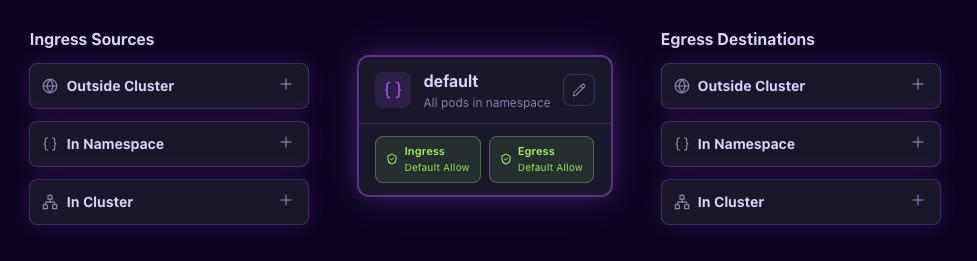

# Network Policy Editor

A browser-based visual editor for Kubernetes Network Policies and Cilium Network Policies. Build, visualize, and export network policies without writing YAML by hand.



Inspired by [editor.networkpolicy.io](https://editor.networkpolicy.io).

## Features

- **Visual canvas** with ingress/egress rule cards connected by SVG arrows to a central target pod
- **Grouped rule cards** — Outside Cluster, In Namespace, In Cluster — with sub-type pickers
- **Dual format support** — generates both Kubernetes `NetworkPolicy` and Cilium `CiliumNetworkPolicy` YAML
- **Bidirectional YAML sync** — edit YAML directly or use the visual editor; changes propagate both ways
- **YAML import** — upload or paste existing policies; auto-detects K8s vs Cilium format
- **Cilium-native constructs** — `toEntities`, `toFQDNs`, `fromEntities`, DNS rules with `matchPattern`
- **Policy rating** — 4-level security strength indicator based on rule specificity
- **Policy warnings** — real-time validation (duplicate rules, missing selectors, broad CIDR ranges)
- **Multi-policy tabs** — work on multiple policies simultaneously
- **Dark/light theme** — synthwave dark theme with neon accents, clean light alternative
- **Fully offline** — runs entirely in the browser, no backend required
- **Copy, download, upload** — one-click actions for policy YAML

## Quick Start

### Docker (recommended)

```bash
docker compose up
```

Open [http://localhost:5173](http://localhost:5173).

### Local

```bash
npm install
npm run dev
```

### Production build

```bash
# Docker
docker compose --profile prod up prod
# → http://localhost:8080

# Or manually
npm run build
npm run preview
```

## Tech Stack

| Layer | Technology |
|-------|-----------|
| Framework | React 19 + TypeScript |
| Build | Vite 6 |
| Styling | Tailwind CSS v4 |
| Tables | TanStack Table v8 |
| Icons | Lucide React |
| YAML | js-yaml |
| State | useReducer + Context |

## Project Structure

```
src/
├── types/policy.ts              # PolicyState, PolicyRule, PortRule types
├── state/                       # Reducer, actions, context provider
├── lib/
│   ├── yaml-gen-k8s.ts          # K8s NetworkPolicy YAML generator
│   ├── yaml-gen-cilium.ts       # CiliumNetworkPolicy YAML generator
│   ├── yaml-parser.ts           # Import parser (auto-detect K8s/Cilium)
│   ├── policy-rating.ts         # Security strength scoring
│   └── validators.ts            # Rule validation & warnings
├── components/
│   ├── canvas/                  # Visual editor (columns, cards, arrows)
│   ├── editors/                 # TanStack Table editors (labels, ports, CIDRs)
│   ├── yaml/                    # YAML panel (tabs, display, rating)
│   └── ui/                      # Shared UI (divider, theme toggle, tabs)
└── hooks/useTheme.ts            # Dark/light theme persistence
```

## Supported Policy Features

### Kubernetes NetworkPolicy
- Pod selectors with `matchLabels`
- Namespace selectors
- IP blocks (`ipBlock.cidr` + `except`)
- Port rules (TCP, UDP, SCTP)
- `policyTypes` (Ingress, Egress)

### Cilium CiliumNetworkPolicy
- Endpoint selectors (`fromEndpoints`, `toEndpoints`)
- Entity rules (`fromEntities`, `toEntities` — cluster, world, host, etc.)
- FQDN rules (`toFQDNs` with `matchPattern`)
- CIDR rules (`fromCIDR`, `toCIDR`, `fromCIDRSet`, `toCIDRSet`)
- DNS rules with `matchPattern: "*"` shortcut
- Namespace label conventions (`io.kubernetes.pod.namespace`, `k8s:` prefix)

## Screenshots

*Coming soon*

## License

[MIT](LICENSE)
